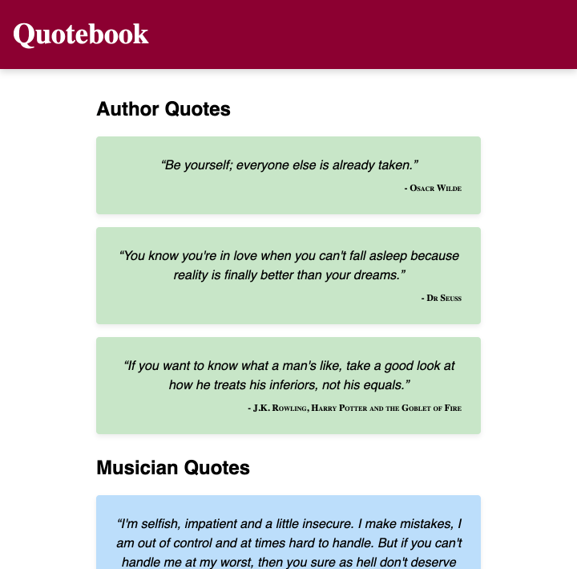

# QuoteBook

Today we are building a website to collect quotes. Quotes are text based so let's use our typography skills to make this site a pleasure to read. An *example* (your implementation doesn't need to be exactly like this!) is below:

## Instructions
- Create a layout for the site
- Gather your favourite quotes and organise them into groups ie. by topic or by author
- Add them to the page and use text elements to create visual hierarchies

## Tips
- Use the appropriate HTML elements and take into consideration HTML semantics
- Use [MDN](https://developer.mozilla.org/en-US/docs/Web/CSS/font-family) as a reference for relevant CSS properties

## Extension 1
- Add fonts from [Google Fonts](https://fonts.google.com/)

## Extension 2
- Add alternating colours to the quotes *without* adding any additional html elements or introducing new classes
